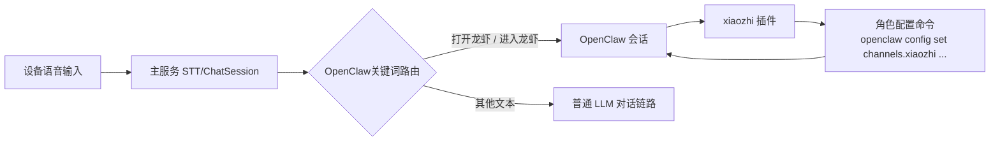

# OpenClaw 接入说明

## 架构图

## 安装步骤

1. 确保 OpenClaw 已正常运行。
2. 在智能体的 `OpenClaw设置` 弹层复制角色配置命令，系统会自动填入当前服务的 WebSocket URL 和该智能体的 JWT token。
3. 在 OpenClaw 控制台角色配置中依次执行以下四条命令：
   `openclaw config set channels.xiaozhi.enabled true --strict-json`
   `openclaw config set channels.xiaozhi.url "{url}"`
   `openclaw config set channels.xiaozhi.token "{token}"`
   `openclaw gateway restart`
4. 其中 `{url}` 和 `{token}` 使用弹层里复制出的实际值替换，最后执行 `openclaw gateway restart` 使配置生效。

## 使用方法

1. 在智能体的 `OpenClaw设置` 弹层点击“复制命令”。
2. 在 OpenClaw 控制台角色配置中执行复制出的四条命令，完成 `enabled`、`url`、`token` 配置并重启 gateway。
3. 安装和配置完成后，即可在 OpenClaw 会话中调用 xiaozhi 插件能力。
4. 在 `查看openclaw` 弹层可使用“发送测试”验证连通性与回复。
5. 在设备侧可通过 `打开龙虾` / `进入龙虾` 进入 OpenClaw 模式，通过 `关闭龙虾` / `退出龙虾` 退出模式。

## 排查建议

- 状态显示未连接：确认 `channels.xiaozhi.url` 与 `channels.xiaozhi.token` 使用的是最新值，且 `channels.xiaozhi.enabled` 已设为 `true`。
- 对话测试超时：检查四条角色配置命令是否执行成功、URL/token 是否正确、是否已执行 `openclaw gateway restart`、OpenClaw 会话是否在线。
